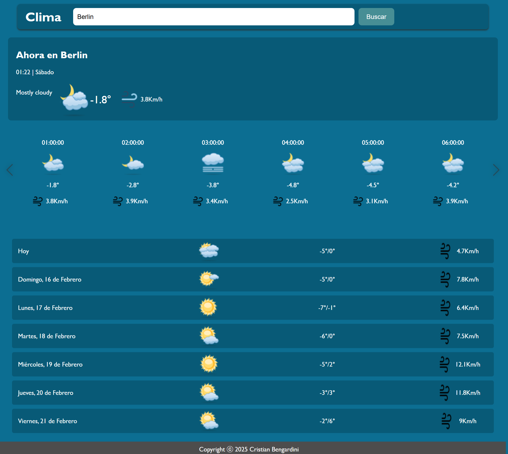

# Clima App

## Descripción

Clima App es una aplicación web desarrollada para consultar el clima actual, por hora y el pronóstico a 7 días de una ciudad o estado. Utiliza tecnologías como JavaScript, HTML, CSS, SASS, junto con algunas librerías externas como SweetAlert2 para mostrar notificaciones de error y Swiffy-Slider para la implementación de un slider interactivo.

La app proporciona información precisa sobre el clima actual y las condiciones horarias mediante el uso de dos APIs externas:

-   **Meteosource API** para obtener los datos meteorológicos.
-   **TimeAPI** para manejar las zonas horarias y la hora local de la ciudad consultada.

El diseño es **responsivo**, asegurando que la aplicación sea accesible desde dispositivos móviles y de escritorio.

## Características

-   **Consulta por ciudad o estado**: El usuario puede ingresar el nombre de una ciudad o estado para obtener la información del clima.
-   **Información del clima**:
    -   Clima actual.
    -   Clima por hora.
    -   Pronóstico de los próximos 7 días.
-   **Validación de entrada**: Solo se permite realizar la consulta si se ingresa un nombre válido de ciudad o estado.
-   **Diseño responsivo**: Se adapta a diferentes tamaños de pantalla para garantizar una experiencia de usuario óptima.
-   **Notificaciones de error**: Si la entrada no es válida, se mostrará un mensaje de error mediante la librería **SweetAlert2**.
-   **Slider interactivo**: Se utiliza **Swiffy-Slider** para visualizar el pronóstico por hora de manera dinámica y atractiva.

## Tecnologías utilizadas

-   **HTML5**: Estructura básica de la página.
-   **CSS3**: Estilos básicos para la presentación.
-   **SASS**: Para el manejo de los estilos de forma más organizada y modular.
-   **JavaScript**: Lógica principal para el manejo de eventos y solicitudes a las APIs.
-   **SweetAlert2**: Librería para mostrar notificaciones de error.
-   **Swiffy-Slider**: Librería para crear un slider interactivo con la información del clima.

## APIs externas

-   **Meteosource**: API para obtener la información meteorológica actual y pronósticos.
    -   [Meteosource API](https://meteosource.com)
-   **TimeAPI**: API para obtener la hora local de la ciudad o estado ingresado, considerando las diferentes zonas horarias.
    -   [TimeAPI.io](https://timeapi.io)

## Instalación

Para poder utilizar la aplicación en tu entorno local, sigue estos pasos:

1.  Clona este repositorio en tu máquina local:
    
    `git clone https://github.com/Cristiann95/app-clima` 
    
2.  Entra al directorio del proyecto:
    
    `cd app-clima` 
    
3.  Abre el archivo `index.html` en tu navegador para comenzar a usar la aplicación.
    

## Uso

1.  Ingresa el nombre de una ciudad o estado en el campo de búsqueda.
2.  Haz clic en el botón "Buscar" para obtener la información del clima.
3.  Si la entrada no es válida, se mostrará un mensaje de error con la librería **SweetAlert2**.
4.  El pronóstico se mostrará en tres secciones diferentes: clima actual, por hora y pronóstico extendido.

## Licencia

Este proyecto está bajo la licencia ISC.